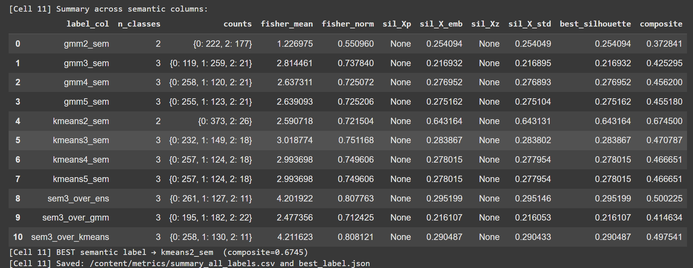
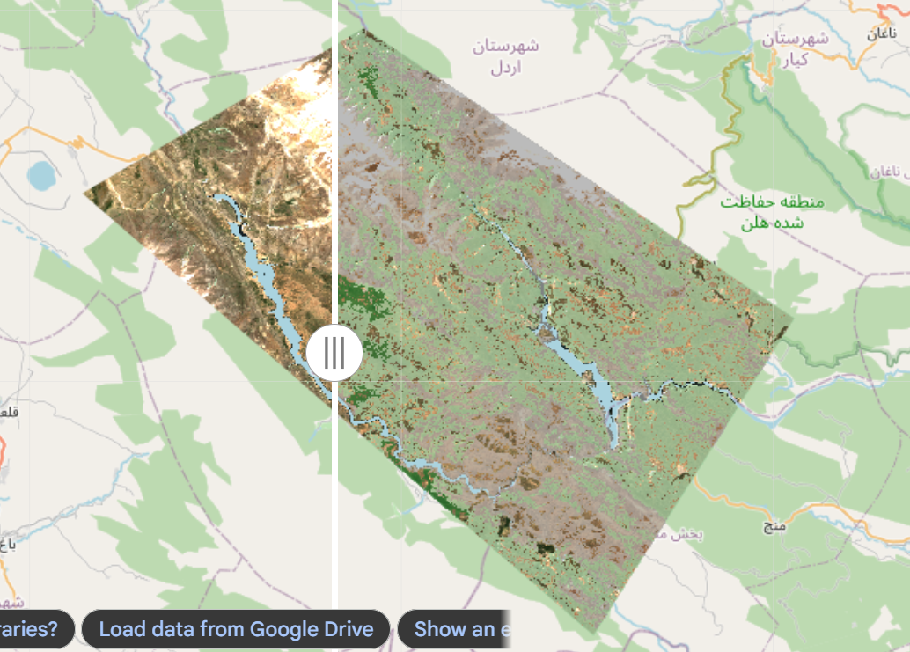
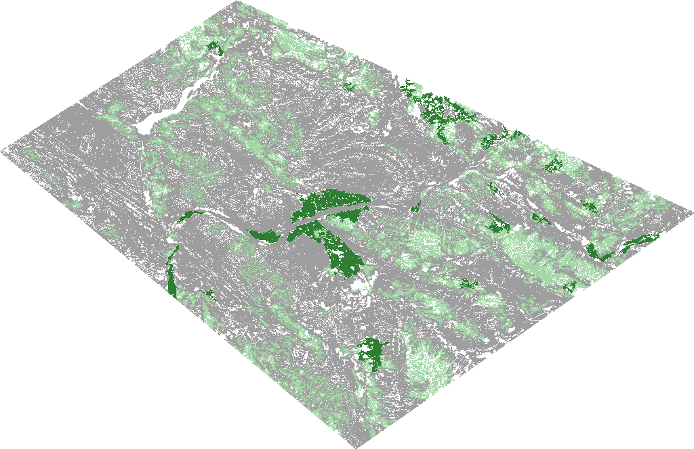

# Sentinel-2 Unsupervised Land Cover Labeling

> **A reproducible pseudo-label generation framework for Sentinel-2 imagery using Google Earth Engine, spectral feature engineering, explainable clustering, and ensemble learning for large-scale land-cover mapping.**

<p align="center">

Remote Sensing • Earth Observation • Geospatial AI • Unsupervised Learning • Google Earth Engine • Pseudo Labeling

</p>

---

## Overview

Large-scale Earth observation applications require enormous amounts of accurately labeled land-cover data. However, creating pixel-level annotations manually is expensive, time-consuming, and difficult to scale.

This repository presents a **reproducible unsupervised land-cover labeling framework** developed during **Fall 2025** as part of a commercial remote sensing project.

Instead of training a supervised classifier, this work focuses on automatically generating **high-quality semantic pseudo-labels** directly from Sentinel-2 imagery through spectral analysis, unsupervised learning, and explainable rule-based semantic mapping.

The generated labels are designed to support downstream machine learning tasks including semantic segmentation, land-cover classification, and self-supervised representation learning.


## Project Visualization

The proposed framework integrates Google Earth Engine processing and local ensemble learning for generating semantic pseudo-labels from Sentinel-2 imagery.

The overall workflow produces both raster-level and polygon-level land-cover representations.

<p align="center">

</p>

<p align="center">
<b>Figure 1.</b>
Sentinel-2 unsupervised land-cover clustering result generated using the Google Earth Engine pipeline.
</p>

---

# Technical Contributions

This repository implements the research components developed by the author, including

- End-to-end pseudo-label generation pipeline for Sentinel-2 imagery
- Hybrid Google Earth Engine + local processing workflow
- Extraction of 17 spectral and texture features
- Multi-stage unsupervised clustering
- Explainable semantic cluster interpretation
- Spatial consistency refinement
- Ensemble pseudo-label generation
- GIS-ready raster and polygon outputs
- Fully reproducible experimental workflow

---

# Research Motivation

Reliable land-cover datasets remain one of the primary bottlenecks in remote sensing and Earth Observation.

Manual annotation of satellite imagery requires extensive human effort and domain expertise, limiting the scalability of supervised deep learning approaches.

This project investigates whether meaningful semantic labels can be generated automatically by combining

- spectral feature engineering
- vegetation indices
- texture descriptors
- unsupervised clustering
- explainable semantic rules
- lightweight ensemble learning

without requiring manually annotated training data.

---

# Repository Structure

```text
sentinel2-unsupervised-landcover-labeling

│
├── notebooks
│   ├── 01_sentinel2_unsupervised_raster_labeling.ipynb
│   └── 02_sentinel2_ensemble_polygon_labeling.ipynb
│
├── figures
│   ├── gee_pipeline/
│   └── ensemble_pipeline/
│
├── docs
│   ├── methodology.md
│   ├── experiments.md
│   └── results.md
│
├── database/
│
│
├── README.md
├── requirements.txt
└── LICENSE
```

---

# System Architecture

```
Sentinel-2 Level-2A

        │

Cloud Masking

        │

Image Composite

        │

Feature Engineering

17 Spectral + Texture Features

        │

KMeans

        │

Gaussian Mixture Model

        │

Cluster Evaluation

        │

Explainable Semantic Mapping

        │

Spatial Smoothing

        │

Raster Labels

        │

Polygon Generation

        │

Ensemble Voting

        │

Final Semantic Pseudo Labels
```

---

## Framework Overview

The framework consists of two complementary pipelines:

1. Google Earth Engine raster pseudo-label generation
2. Local ensemble polygon labeling

The two-stage design enables both pixel-level mapping and GIS-ready vector annotation.

<p align="center">

</p>

<p align="center">
<b>Figure 2.</b>
Area of Interest characterization including geometry information, bounding box, centroid and spatial extent.
</p>

---

# Pipeline I — Google Earth Engine Raster Labeling

The first workflow performs large-scale raster labeling entirely inside Google Earth Engine.

Major processing stages include

- AOI definition
- Sentinel-2 compositing
- Cloud masking
- Spectral feature extraction
- Texture extraction
- KMeans clustering
- Gaussian Mixture clustering
- Cluster quality evaluation
- Explainable semantic mapping
- Spatial filtering
- GeoTIFF export
- Earth Engine Asset export

---

## Google Earth Engine Pipeline Results

The first pipeline generates raster pseudo-labels directly within Google Earth Engine.

The workflow includes:

- Sentinel-2 compositing
- Feature engineering
- Unsupervised clustering
- Semantic interpretation
- Spatial refinement


<p align="center">

</p>

<p align="center">
<b>Figure 3.</b>
Ranking of KMeans and Gaussian Mixture Model clustering configurations using internal validation criteria.
</p>

---

# Pipeline II — Local Ensemble Polygon Labeling

The second workflow operates locally using Sentinel-2 Cloud Optimized GeoTIFFs.

Major components include

- AOI registry
- Composite generation
- Polygon extraction
- Spectral statistics
- Ensemble clustering
- Majority voting
- GeoJSON export
- GeoPackage export
- Interactive HTML visualization

---

## Ensemble Polygon Labeling Results


The second pipeline generates GIS-ready vector pseudo-labels by combining multiple unsupervised and lightweight supervised models.


<p align="center">

</p>

<p align="center">
<b>Figure 10.</b>
Final ensemble semantic labeling map generated from Sentinel-2 imagery.
</p>

---

# Spectral Features

The feature engineering stage extracts 17 remote sensing descriptors, including

- NDVI
- NDWI
- NDMI
- NDBI
- NBR
- REIP
- SAVI
- Tasseled Cap Brightness
- Tasseled Cap Greenness
- Tasseled Cap Wetness
- GLCM texture descriptors

These features provide complementary spectral and spatial information for unsupervised semantic clustering.

---

<p align="center">

</p>

<p align="center">
<b>Figure 4.</b>
Spectral index statistics extracted from Sentinel-2 composites across multiple AOIs.
</p>

---

# Clustering Algorithms

| Algorithm | Purpose |
|-----------|---------|
| KMeans | Spectral clustering |
| Gaussian Mixture Model | Probabilistic clustering |
| Ensemble Voting | Final pseudo-label generation |

---

# Explainable Semantic Mapping

Raw cluster IDs are transformed into meaningful semantic land-cover classes using interpretable spectral decision rules based on

- NDVI
- NDWI
- Vegetation Score

This improves both interpretability and reproducibility of the generated labels.

---

<p align="center">

</p>

<p align="center">
<b>Figure 5.</b>
Explainable semantic mapping of spectral clusters into meaningful land-cover categories using NDVI/NDWI-based rules.
</p>

---

# Experimental Results

## Pipeline I — Google Earth Engine

Study Area

**≈ 938 km²**

### Final Classes

- Non-Vegetation / Water
- Sparse Vegetation
- Dense Vegetation


## Visual Evaluation of Raster Labels


### KMeans Clustering

<p align="center">

</p>

<p align="center">
<b>Figure 6.</b>
Raw KMeans clustering output with pixel statistics and class area estimation.
</p>


### KMeans

| Class | Area (ha) |
|---------|-----------:|
| Non-Vegetation | 59,661.65 |
| Sparse Vegetation | 23,451.85 |
| Dense Vegetation | 5,703.01 |


<p align="center">

</p>

<p align="center">
<b>Figure 7.</b>
Spatially refined KMeans result after 3×3 focal mode filtering.
</p>


### Gaussian Mixture

| Class | Area (ha) |
|---------|-----------:|
| Non-Vegetation | 53,264.46 |
| Sparse Vegetation | 30,231.68 |
| Dense Vegetation | 5,558.65 |


### Gaussian Mixture Model


<p align="center">

</p>

<p align="center">
<b>Figure 8.</b>
Split visualization comparing Sentinel-2 background imagery and GMM classification output.
</p>


<p align="center">

</p>

<p align="center">
<b>Figure 9.</b>
Final three-class semantic map generated using GMM clustering (k=3).
</p>


Both clustering approaches produced consistent semantic distributions, with non-vegetated regions dominating the study area and dense vegetation accounting for approximately 6% of the mapped surface.

---

## Pipeline II — Ensemble Polygon Labeling

Final semantic classes

| Class | Area (ha) |
|---------|-----------:|
| Non-tree Vegetation | 2,097.80 |
| Non-Vegetation | 232.07 |
| Tree Vegetation | 167.46 |
| Unknown | 26.31 |

### Internal Clustering Quality

| Metric | Value |
|---------|------:|
| Silhouette Score | 0.585 |
| Davies–Bouldin Index | 0.542 |


<p align="center">

</p>

<p align="center">
<b>Figure 11.</b>
PCA projection showing separation between semantic vegetation clusters.
</p>

PCA visualization demonstrated good separation between semantic vegetation classes after ensemble refinement.

---

## Qualitative Assessment


Representative samples from generated classes are shown below.


<p align="center">


</p>


<p align="center">
<b>Figure 12.</b>
Representative examples of generated semantic land-cover classes.
</p>

---

# Outputs

The framework exports

- Google Earth Engine Assets
- GeoTIFF
- GeoJSON
- GeoPackage (GPKG)
- Interactive HTML Maps

ready for visualization in QGIS, ArcGIS, or downstream machine learning pipelines.

---

# Technologies

- Python
- Google Earth Engine
- Sentinel-2 Level-2A
- NumPy
- Pandas
- Scikit-learn
- Rasterio
- GeoPandas
- Folium
- Matplotlib
- Jupyter Notebook

---

# Reproducibility

Clone the repository

```bash
git clone https://github.com/hannah-fathi/sentinel2-unsupervised-landcover-labeling.git
```

Install dependencies

```bash
pip install -r requirements.txt
```

Run the notebooks sequentially

```
01 → Google Earth Engine Raster Labeling

02 → Local Ensemble Polygon Labeling
```

---

# Limitations

- The current framework focuses on vegetation-oriented land-cover classes.
- Semantic mapping relies on handcrafted spectral decision rules.
- Proprietary datasets from the commercial project are excluded.
- Experimental evaluation is limited to selected Sentinel-2 AOIs.

---

# Future Work

- Temporal land-cover monitoring
- Self-supervised representation learning
- Active learning for pseudo-label refinement
- Integration with semantic segmentation networks
- Foundation Models for Earth Observation
- Diffusion-based pseudo-label enhancement

---

# Research Timeline

| Period | Milestone |
|----------|------------------------------------------------------------|
| **Fall 2025** | Development of the unsupervised labeling framework within a commercial remote sensing project |
| **2026** | Repository refactoring, documentation, and public research release |

---

# Project Scope

This repository documents the research components implemented by the author as part of a larger commercial remote sensing project.

Confidential datasets, proprietary assets, and organization-specific implementation details have been intentionally excluded.

Only reproducible research components are included.

---

# Author

**Hannah Fathi**

M.Sc. Artificial Intelligence

Research Interests

- Remote Sensing
- Geospatial Artificial Intelligence
- Computer Vision
- Earth Observation
- Self-Supervised Learning
- Foundation Models

---

# Citation

```bibtex
@misc{fathi2026sentinel2,
  author       = {Hannah Fathi},
  title        = {Sentinel-2 Unsupervised Land Cover Labeling},
  year         = {2026},
  publisher    = {GitHub},
  howpublished = {\url{https://github.com/hannah-fathi/sentinel2-unsupervised-landcover-labeling}}
}
```

---

# License

This project is released under the MIT License.
